# MojaKancelaria

## Spis treści
* [Technologie](#technologie)
* [Głowne informacje](#głowne-informacje)
* [Opis Aplikacji](#opis-aplikacji)

## Technologie

## Głowne informacje
Aplikacja mobilna tworzona z wykorzystaniem języka Kotlin. W celu komunikacji z bazą SQLite wykorzystany
został framework Room. 

Tworzona przez:
* [Wiktoria Salamon](https://github.com/wikk2207)
* [Maciej Lewandowicz](https://github.com/sasuke5055)

## Opis Aplikacji
Celem projektu było stworzenie aplikacji wspomagającej zarządzanie kancelarią prawną, poprzez dokumentowanie oraz bieżące śledzenie
różnych typów zobowiązań, wpłat, oraz innych istotnych rzeczy, jak awiza i terminy odbiorów. 

Aplikacja umożliwia dodawanie klientów, dla każdego z nich różnych spraw oraz opłat. 

### Nawigacja po aplikacji

W celu łatwiejszej nawigacji po apliakcji zastosowane zostało boczne menu:

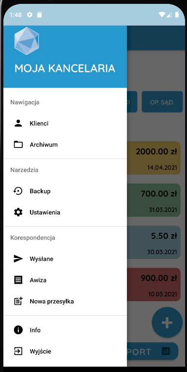

### Klienci sprawy i zobowiązania

Widok klientów:

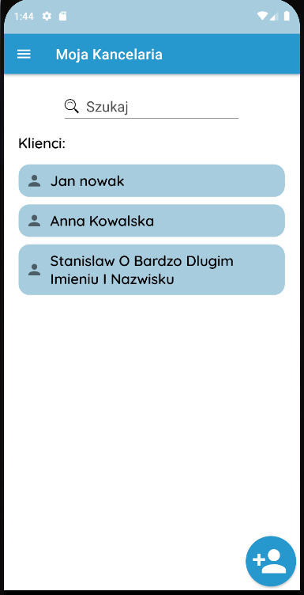

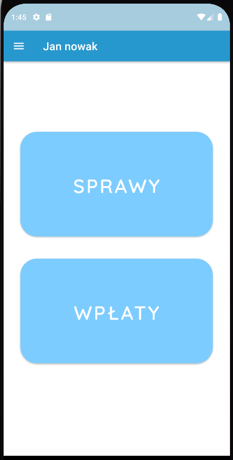

Widok spraw danego klienta:

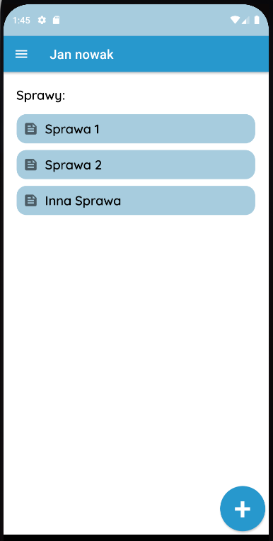

Widok zobowiązań przypisanych do danej sprawy:

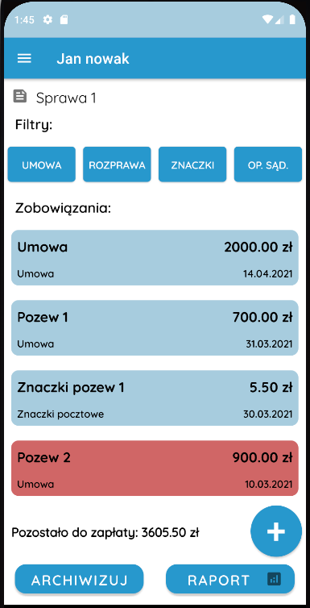

Zobowiązania wyróżniają się kolorem, w zależności do statusu: czy są opłacone, częściowo opłacone, nieopłacone, bądź
czy klient zwleka z terminową zapłatą.

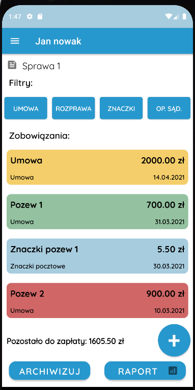

Widok dodawania wpłaty: 

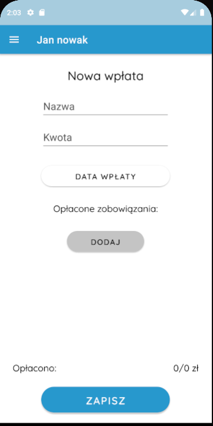

Wybór zobowiązań do opłacenia:

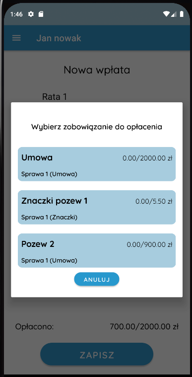

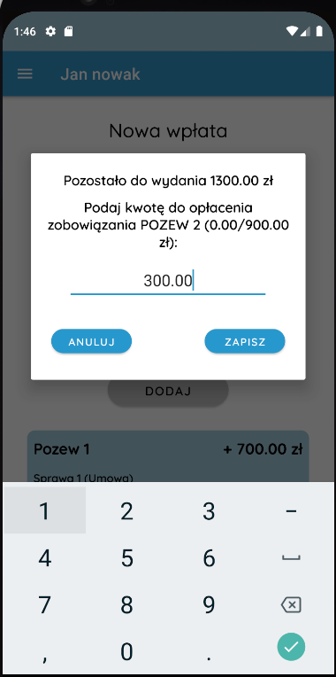

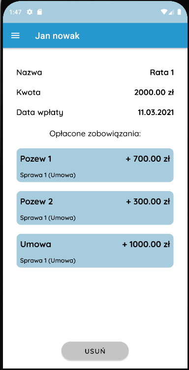

Istnieje możliwość filtrowania zobowiąząń po ich typie:

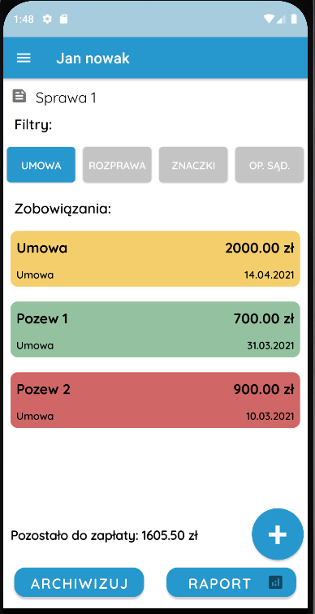

### Raport

Dodatkową funkcjonalnością jest możliwosć wygenerowania raportu dla danej sprawy do pliku pdf oraz wysłanie 
jako załącznika w wiadomości email:

### Archiwum

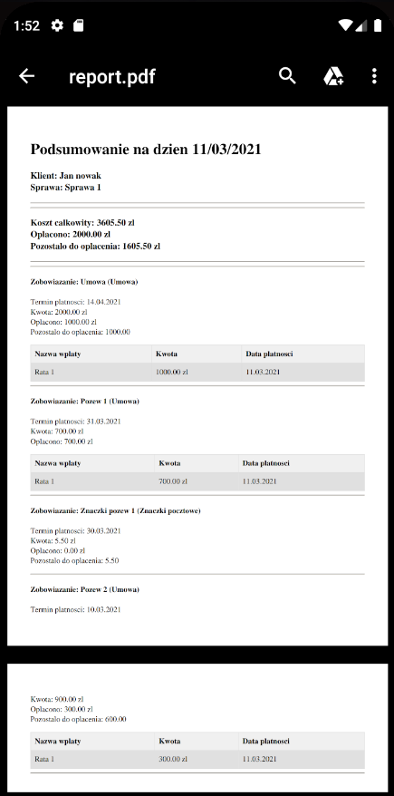

W przypadku zakończenia danej sprawy istnieje możliwosć jej archiwizacji. 

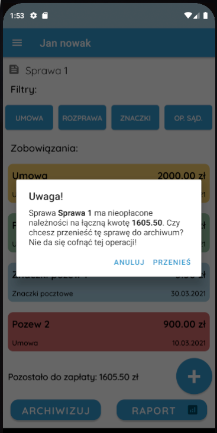

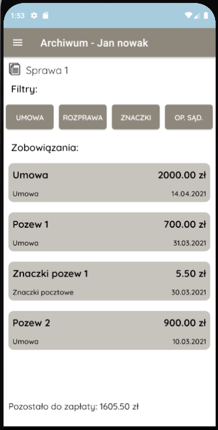

### Korespondencja

Śledzenie korespondencji polega na dodaniu numeru przesyłki:

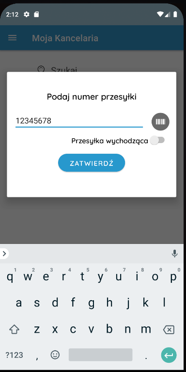

Następnie aktualny status każdej z przesyłek pobierany jest z api poczty.

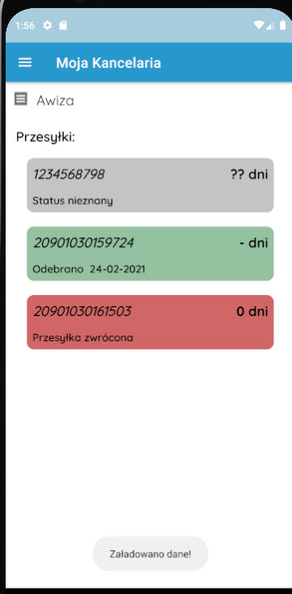

# Backup, autobackup oraz ustawienia

Zaimplementowana została możliwosć backupu oraz przywracana bazy danych do pliku. 

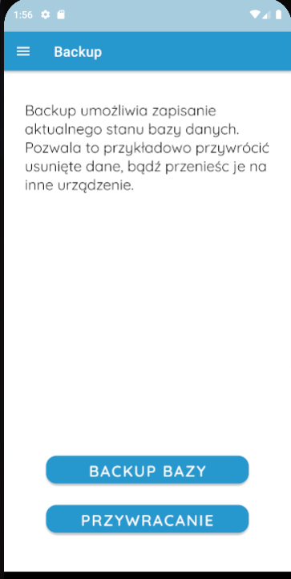

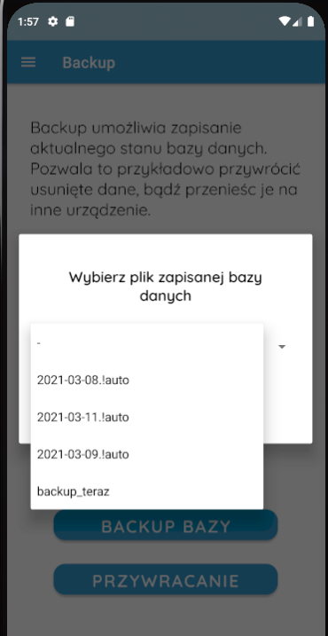

W zakładce ustawień można dostosować automatyczny backup do swoich potrzeb

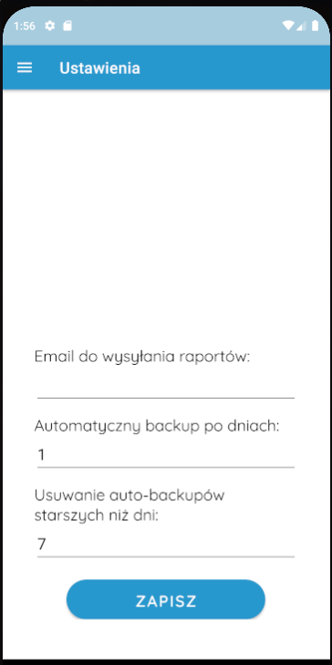

